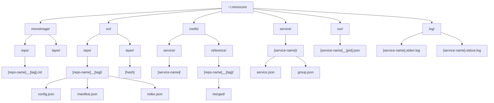

<div align="center">
  <a href="https://github.com/appcypher/monocore" target="_blank">
    </img>
  </a>

  <h1>monocore</h1>

  <p>
    <a href="https://github.com/appcypher/monocore/actions?query=">
      
    </a>
    <a href="https://github.com/appcypher/monocore/blob/main/LICENSE">
      
    </a>
  </p>
</div>

**`monocore`** is the engine behind the monocore platform, providing a robust foundation for running AI workloads in isolated microVMs. It handles everything from VM lifecycle management to OCI image distribution, making it easy to deploy and orchestrate code sandboxes securely.

> [!WARNING]
> This project is in early development and is not yet ready for production use.

## Table of Contents

- [Overview](#overview)
- [Getting Started](#getting-started)
  - [Installation](#installation)
  - [Basic Usage](#basic-usage)
- [Features](#features)
- [Architecture](#architecture)
- [Development](#development)
- [License](#license)

## Overview

Monocore provides:
- 🔒 Secure isolation through microVMs
- 🏃 Efficient container-like experience
- 📦 OCI-compatible image management
- 🎯 Simple service orchestration

## Getting Started

### Installation

**Prerequisites:**
- Rust toolchain (1.75+)
- Linux OS / macOS
- libkrun (installed automatically)

**Build and Install:**
```bash
# Clone the repository
git clone https://github.com/appcypher/monocore.git
cd monocore

# Build and install (installs to /usr/local/bin)
make monocore && sudo make install
```

### Basic Usage

1. Create a configuration file:
```toml
# monocore.toml
[[service]]
name = "counter"
base = "alpine:latest"
ram = 512
group = "main"
command = "/usr/bin/count"

[[service]]
name = "date-service"
base = "alpine:latest"
ram = 256
group = "main"
command = "/bin/date"
```

2. Manage your services:
```bash
# Pull required images
monocore pull alpine:latest

# Start services
monocore up -f monocore.toml

# View status
monocore status

# Stop services
monocore down

# Remove services
monocore remove -g main
```

For more CLI options:
```bash
monocore --help
```

## Features

### Secure Isolation
- Isolated microVM environments for each service
- Resource constraints and limits enforcement
- Network isolation between service groups

### Efficient Runtime
- Fast microVM provisioning and startup
- Minimal resource overhead
- Optimized layer caching and sharing

### OCI Integration
- Pull images from any OCI-compliant registry
- Smart layer management and deduplication
- Local image caching for faster startups

### Service Orchestration
- Dependency-aware service scheduling
- Health monitoring and automatic recovery
- Log rotation with configurable retention

## Architecture

### Directory Structure

Monocore maintains its state in `~/.monocore`:



### API Examples

**Basic MicroVM:**
```rust
use monocore::vm::MicroVm;

#[tokio::main]
async fn main() -> anyhow::Result<()> {
    let vm = MicroVm::builder()
        .root_path("/path/to/rootfs")
        .ram_mib(512)
        .exec_path("/bin/echo")
        .args(["Hello from microVM!"])
        .build()?;

    vm.start()?;
    Ok(())
}
```

**Service Orchestration:**
```rust
use monocore::{
    config::{Group, Monocore, Service},
    orchestration::Orchestrator,
};

#[tokio::main]
async fn main() -> anyhow::Result<()> {
    let service = Service::builder_default()
        .name("ai-agent")
        .base("alpine:latest")
        .ram(512)
        .build();

    let config = Monocore::builder()
        .services(vec![service])
        .groups(vec![Group::builder().name("agents").build()])
        .build()?;

    let mut orchestrator = Orchestrator::new("/path/to/rootfs", "/path/to/supervisor").await?;
    orchestrator.up(config).await?;

    Ok(())
}
```

## Development

### Running Examples

```bash
# Basic MicroVM Examples
make example microvm_shell     # Interactive shell in MicroVM
make example microvm_nop       # Simple no-op MicroVM

# Networking Examples
make example microvm_curl [-- --local-only] [-- <target>]  # HTTP requests from MicroVM
make example microvm_tcp -- --server                       # TCP server (port 3456)
make example microvm_tcp                                   # TCP client
make example microvm_udp -- --server                       # UDP server
make example microvm_udp                                   # UDP client

# OCI Image Examples
make example oci_pull          # Pull images from Docker Hub
make example oci_merge         # Merge image layers with OverlayFS

# Orchestration Examples
make example orchestration_basic   # Basic service management
make example orchestration_load    # Service state persistence
```

### Development Tips

- Use `RUST_BACKTRACE=1` for detailed error traces
- On macOS, examples are automatically signed with entitlements
- The build directory (`~/.monocore`) contains logs and service state
- Check service logs in `~/.monocore/log/` for debugging

## License

This project is licensed under the [Apache License 2.0](./LICENSE).
