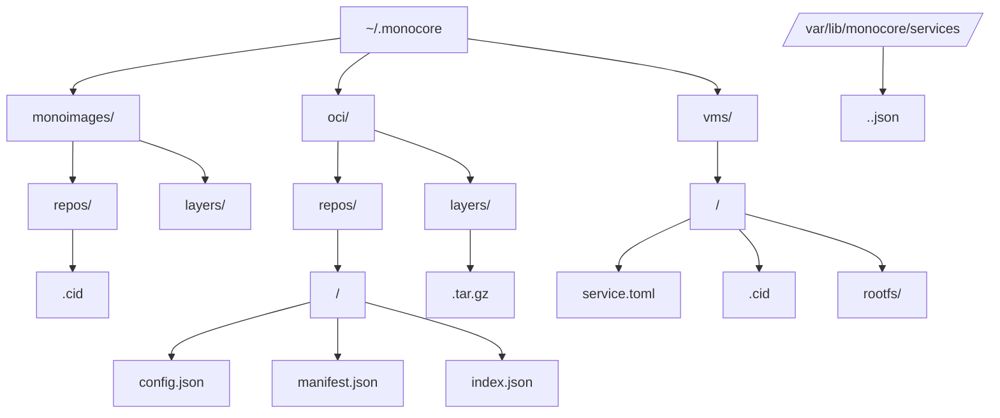

```mermaid
graph TD
    A[~/.monocore] --> B[monoimages/]
    B --> C[repos/]
    C --> D[<repo-name:tag>.cid]
    B --> E[layers/]

    A --> F[oci/]
    F --> G[repos/]
    G --> H[<repo-name:tag>/]
    H --> I[config.json]
    H --> J[manifest.json]
    H --> K[index.json]
    F --> L[layers/]
    L --> M[<hash>.tar.gz]

    A --> N[vms/]
    N --> O[<repo-name:tag>/]
    O --> P[service.toml]
    O --> Q[<repo-name:tag>.cid]
    O --> R[rootfs/]

    S[/var/lib/monocore/services/] --> T[<pid>.<service-name>.json]
```
