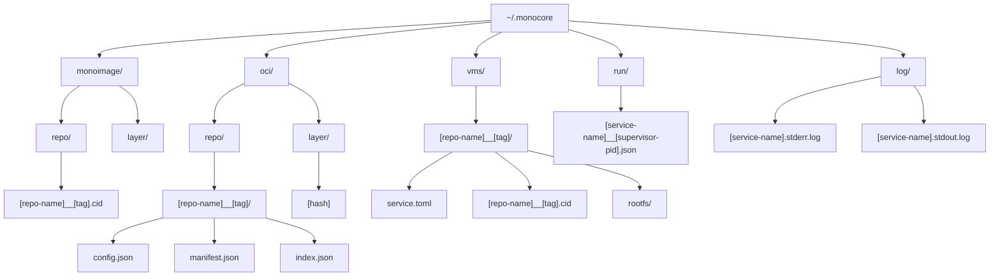

# Monocore Directory Structure

Here is the directory structure of `MONOCORE_HOME`:

```mermaid
graph TD
    A[~/.monocore] --> B[monoimage/]
    B --> C[repo/]
    C --> D["[repo-name]__[tag].cid"]
    B --> E[layer/]

    A --> F[oci/]
    F --> G[repo/]
    G --> H["[repo-name]__[tag]/"]
    H --> I[config.json]
    H --> J[manifest.json]
    H --> K[index.json]
    F --> L[layer/]
    L --> M["[hash]"]

    A --> N[vms/]
    N --> O["[repo-name]__[tag]/"]
    O --> P[service.toml]
    O --> Q["[repo-name]__[tag].cid"]
    O --> R[rootfs/]

    A --> S[run/]
    S --> T["[service-name]__[supervisor-pid].json"]

    A --> U[log/]
    U --> V["[service-name].stderr.log"]
    U --> W["[service-name].stdout.log"]
```
