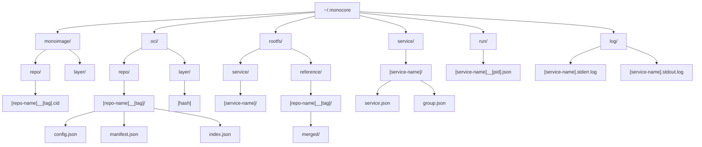

<div align="center">
  <a href="https://github.com/appcypher/monocore" target="_blank">
    </img>
  </a>

  <h1>monocore</h1>

  <p>
    <a href="https://discord.gg/T95Y3XnEAK">
      
    </a>
    <a href="https://github.com/appcypher/monocore/actions?query=">
      
    </a>
    <a href="https://crates.io/crates/monocore">
      
    </a>
    <a href="https://docs.rs/monocore">
      
    </a>
    <a href="https://github.com/appcypher/monocore/blob/main/LICENSE">
      
    </a>
  </p>
</div>

**`monocore`** is the engine behind the monocore platform, providing a robust foundation for running AI workloads in isolated microVMs. It handles everything from VM lifecycle management to OCI image distribution, making it easy to deploy and orchestrate code sandboxes securely.

> [!WARNING]
> This project is in early development and is not yet ready for production use.

## Table of Contents

- [Overview](#overview)
- [Library Usage](#library-usage)
- [Getting Started](#getting-started)
- [Features](#features)
- [Architecture](#architecture)
- [Development](#development)
- [License](#license)

## Overview

When developing AI agents that execute code, you need a fast development cycle:

- Docker containers? Limited isolation for untrusted code
- Traditional VMs? Minutes to start up, heavy resource usage
- Direct execution? Risky for your development machine
- Cloud sandboxes? Great for production, but slow for rapid iteration

monocore provides:
- 🔒 True VM-level isolation
- ⚡ Millisecond startup times
- 🎯 Simple REST API
- 📦 Works with standard container images
- 🔧 Full resource control
- 💻 Perfect for local development

## Library Usage

### Basic MicroVM
```rust
use monocore::vm::MicroVm;

#[tokio::main]
async fn main() -> anyhow::Result<()> {
    // Build the MicroVm
    let vm = MicroVm::builder()
        .root_path("/path/to/rootfs")  // Path to rootfs
        .ram_mib(512)
        .exec_path("/bin/true")  // Simple no-op command
        .build()?;

    // Start the MicroVm
    tracing::info!("Starting MicroVm...");
    vm.start()?;
    Ok(())
}
```

### Service Orchestration
```rust
use monocore::{
    config::{Group, Monocore, Service},
    orchestration::Orchestrator,
};

#[tokio::main]
async fn main() -> anyhow::Result<()> {
    // Create a simple service
    let service = Service::builder_default()
        .name("app")
        .base("alpine:latest")
        .ram(512)
        .group("main")  // Group name is required
        .command("/bin/sleep")  // Example command
        .args(["infinity"])     // Run indefinitely
        .build();

    // Create the main group
    let main_group = Group::builder()
        .name("main")
        .build();

    let config = Monocore::builder()
        .services(vec![service])
        .groups(vec![main_group])
        .build()?;

    // Create orchestrator with log retention
    let mut orchestrator = Orchestrator::with_log_retention_policy(
        "/path/to/oci_dir",
        "/path/to/supervisor",
        LogRetentionPolicy::with_max_age_weeks(1),
    ).await?;

    // Start the service
    orchestrator.up(config).await?;

    Ok(())
}
```

## Getting Started

### Installation

**Quick Install:**
```bash
curl -sSfL https://install.monocore.dev | sh
```

This will install both the `monocore` command and its alias `mc`.

**System Requirements:**

<details>
<summary><b>Linux</b></summary>

- KVM-enabled Linux kernel (check with `ls /dev/kvm`)
- User must be in the `kvm` group (add with `sudo usermod -aG kvm $USER`)
</details>

<details>
<summary><b>macOS</b></summary>

- Apple Silicon (ARM64) only
- macOS 10.15 (Catalina) or later for Hypervisor.framework support
</details>

<details>
<summary><b>Windows</b></summary>

> Coming soon!
</details>


**Manual Build:**
```bash
# Clone the repository
git clone https://github.com/appcypher/monocore.git
cd monocore

# Build and install (installs to /usr/local/bin)
make monocore && sudo make install
```

### Basic Usage

1. Create a configuration file:
```toml
# monocore.toml
[[service]]
name = "counter"
base = "alpine:latest"
ram = 512
group = "main"
command = "/usr/bin/count"

[[service]]
name = "date-service"
base = "alpine:latest"
ram = 256
group = "main"
command = "/bin/date"
```

2. Manage your services:
```bash
# Pull required images
monocore pull alpine:latest

# Start services
monocore up -f monocore.toml

# View status
monocore status

# Stop services
monocore down

# Remove services
monocore remove -g main
```

3. Run in server mode:
```bash
# Start the REST API server (default port: 3456)
monocore serve --port 3456

# Or use the default port
monocore serve
```

For more CLI options:
```bash
monocore --help
```

### REST API

When running in server mode, monocore provides a REST API for managing services:

| Endpoint | Method | Description |
|----------|--------|-------------|
| `/up`    | POST   | Start services defined in config |
| `/down`  | POST   | Stop running services |
| `/status`| GET    | Get status of all services |
| `/remove`| POST   | Remove service files |

Example API usage:

```bash
# Start services
curl -X POST http://localhost:3456/up \
  -H "Content-Type: application/json" \
  -d @monocore.json

# Get service status
curl http://localhost:3456/status

# Stop services in a group
curl -X POST http://localhost:3456/down \
  -H "Content-Type: application/json" \
  -d '{"group": "main"}'

# Remove services
curl -X POST http://localhost:3456/remove \
  -H "Content-Type: application/json" \
  -d '{"services": ["counter", "date-service"]}'
```

## Features

### Secure Isolation
- Isolated microVM environments for each service
- Resource constraints and limits enforcement
- Network isolation between service groups
- Perfect for running untrusted AI-generated code
- Full system call isolation

### Efficient Runtime
- Fast microVM provisioning and startup
- Millisecond-level boot times
- Minimal resource overhead
- Optimized layer caching and sharing
- Memory-efficient design

### OCI Integration
- Pull images from any OCI-compliant registry
- Smart layer management and deduplication
- Local image caching for faster startups
- Support for standard container images
- Seamless Docker compatibility

### Service Orchestration
- Dependency-aware service scheduling
- Health monitoring and automatic recovery
- Log rotation with configurable retention
- Resource usage tracking
- Group-based service management

## Architecture

### Directory Structure

Monocore maintains its state in `~/.monocore`:



## Development

For development setup and building from source, please visit the [root of the project repository](https://github.com/appcypher/monocore).

## License

This project is licensed under the [Apache License 2.0](./LICENSE).
