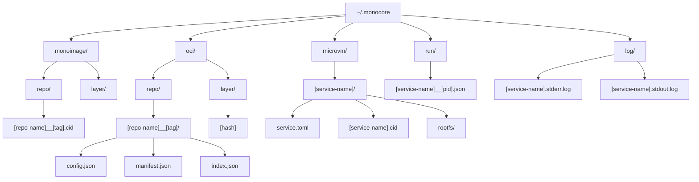

<div align="center">
  <h1>monocore</h1>
  <p>Core library powering secure, sandboxed AI environments</p>

  <p>
    <a href="https://github.com/appcypher/monocore/actions?query=">
      
    </a>
    <a href="https://github.com/appcypher/monocore/blob/main/LICENSE">
      
    </a>
  </p>
</div>

**`monocore`** is the engine behind the monocore platform, providing a robust foundation for running AI workloads in isolated microVMs. It handles everything from VM lifecycle management to OCI image distribution, making it easy to deploy and orchestrate AI agents securely.

> [!WARNING]
> This project is in early development and is not yet ready for production use.

##

## Outline

- [Features](#features)
- [Directory Structure](#directory-structure)
- [Quick Start](#quick-start)
- [Development](#development)
- [License](#license)

## Features

### 🔒 Secure by Design
- Isolated microVM environments for each service
- Resource constraints and limits enforcement
- Network isolation between service groups

### 🏃 Efficient Runtime
- Fast microVM provisioning and startup
- Minimal resource overhead
- Optimized layer caching and sharing

### 📦 OCI Integration
- Pull images from any OCI-compliant registry
- Smart layer management and deduplication
- Local image caching for faster startups

### 🎯 Service Orchestration
- Dependency-aware service scheduling
- Health monitoring and automatic recovery
- Log rotation with configurable retention

## Directory Structure

The library maintains its state in `~/.monocore`:



## Quick Start

### Basic MicroVM
```rust
use monocore::vm::MicroVm;

#[tokio::main]
async fn main() -> anyhow::Result<()> {
    let vm = MicroVm::builder()
        .root_path("/path/to/rootfs")
        .ram_mib(512)
        .exec_path("/bin/echo")
        .args(["Hello from microVM!"])
        .build()?;

    vm.start()?;
    Ok(())
}
```

### Service Orchestration
```rust
use monocore::{
    config::{Group, Monocore, Service},
    orchestration::Orchestrator,
};

#[tokio::main]
async fn main() -> anyhow::Result<()> {
    let service = Service::builder_default()
        .name("ai-agent")
        .base("alpine:latest")
        .ram(512)
        .build();

    let config = Monocore::builder()
        .services(vec![service])
        .groups(vec![Group::builder().name("agents").build()])
        .build()?;

    let mut orchestrator = Orchestrator::new("/path/to/rootfs", "/path/to/supervisor").await?;
    orchestrator.up(config).await?;

    Ok(())
}
```

## Development

### Prerequisites
- Rust toolchain (1.75+)
- libkrun (see [monocore/README.md](http://github.com/appcypher/monocore#setup))
- Linux OS for full functionality (OverlayFS support)
  - macOS users should use Docker Desktop or a Linux VM for development

### Examples
The `examples/` directory showcases key features:
- `microvm_shell.rs`: Basic microVM usage
- `oci_pull.rs`: Image pulling and caching
- `orchestration_basic.rs`: Service orchestration
- `orchestration_load.rs`: Load testing

Check the top of each file for usage instructions.

## License

This project is licensed under the [Apache License 2.0](./LICENSE).
